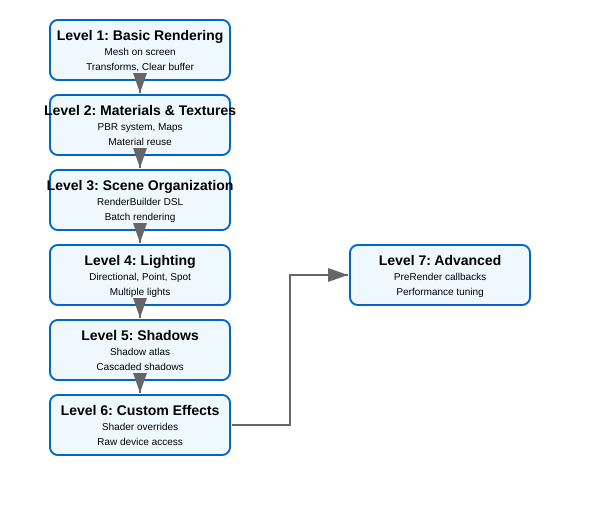
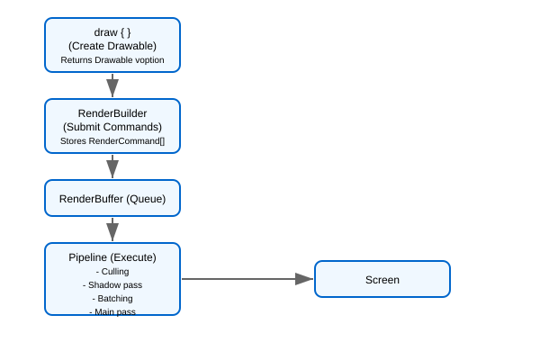

# Render Pipeline Architecture & Usage

Mibo 3D uses a modern, data-oriented rendering pipeline designed for flexibility and performance. This guide covers both the high-level architecture and the practical "Complexity Ladder" for using it in your game.

---

## Part 1: Complexity Ladder

Mibo's 3D rendering is designed to scale with your needs. You can start with simple unlit shapes and climb all the way to high-fidelity PBR with shadow casting, without rewriting your game loop.

### Level 1: Basic Rendering

At the simplest level, you just want to get a mesh on the screen.

```fsharp
open Mibo.Rendering.Graphics3D

// In your view function
let view (ctx: GameContext) (state: State) (buffer: RenderBuffer<unit, RenderCommand>) =

    // 1. Define a camera
    let camera = Camera.perspective ...

    // 2. Submit commands to the buffer using the fluent API
    buffer
        .Camera(camera)
        .Clear(Color.CornflowerBlue)
        .Draw(
            draw {
                mesh state.MyMesh
                at Vector3(0f, 0f, 0f)
                scaledBy 2.0f
            }
        )
        .Submit()
```

#### The `draw` Builder

The `draw` computation expression is how you compose a generic `Mesh` into a specific instance in the world.

```fsharp
draw {
    mesh myMesh
    at 10f 0f 5f                        // Position (x, y, z)
    rotatedByYawPitchRoll 0f 1.5f 0f     // Rotation (yaw, pitch, roll in radians)
    scaledBy 1.5f                         // Uniform scale
    withAlbedo Color.Red                     // Basic tint color
}
```

**Result:** Returns a `Drawable voption` which can be submitted to the render buffer. The `voption` allows the builder to fail gracefully (e.g., no mesh set), and `buffer.Draw` automatically handles `ValueNone` by skipping it.

#### Advanced Transform Operations

For complex scene hierarchies, use parent-relative transforms:

```fsharp
// Create a parent transform
let parentTransform = Matrix.CreateTranslation(10f, 0f, 0f) * Matrix.CreateRotationY(MathHelper.PiOver4)

draw {
    mesh childObject
    relativeTo parentTransform    // Position is relative to parent
    at 2f 0f 0f                 // Local offset from parent position
    rotatedByYawPitchRoll 0f 0f MathHelper.PiOver2
}
```

Or set the complete transform directly:

```fsharp
let complexTransform =
    Matrix.CreateScale(2f) *
    Matrix.CreateRotationX(rotation) *
    Matrix.CreateTranslation(position)

draw {
    mesh object
    withTransform complexTransform  // Completely overrides position/rotation/scale
}
```

### Level 2: Quads, Billboards & Lines

Mibo includes an optimized, unlit path for "Sprite3D" style rendering. This is ideal for decals, particles, and debug visualizations.

#### Quads (Sprite3D)

Quads are fast textured rectangles. Typical uses: ground decals, simple walls, UI in world space.

```fsharp
// Define a 2x2 ground decal on the XZ plane
let decal =
    quad {
        at (Vector3(10f, 0f, 5f))
        onXZ (Vector2(2f, 2f))
        color Color.White
    }

// Submit to buffer (defaults to Opaque, use RenderPass.Transparent for decals)
buffer.Quad(myTexture, decal, RenderPass.Transparent)
```

#### Billboards (Sprite3D)

Billboards always face the camera. Ideal for smoke, fire, or quest icons.

```fsharp
let spark =
    billboard {
        at (Vector3(0f, 1.5f, 0f))
        size (Vector2(0.5f, 0.5f))
        color Color.Yellow
    }

// Defaults to Transparent pass
buffer.Billboard(particleTex, spark)
```

For "tree style" billboards that only rotate around an axis:

```fsharp
let tree =
    billboard {
        at pos
        size (Vector2(2f, 4f))
        facing (Cylindrical Vector3.Up)
    }

buffer.Billboard(treeTex, tree)
```

#### Lines & Grids

Draw single or multiple line segments efficiently for debugging or wireframes.

```fsharp
// Single red line
buffer.Line(Vector3.Zero, Vector3(0f, 10f, 0f), Color.Red)

// Grid or complex path
let verts = [|
    VertexPositionColor(p1, Color.White)
    VertexPositionColor(p2, Color.White)
|]
buffer.Line(verts, verts.Length / 2)

// Line segments with a custom shader (e.g. glowing grid)
buffer.Line(RenderPass.Transparent, myShader, ValueSome mySetup, verts, verts.Length / 2)
```

### Level 3: Materials & Textures

Mibo uses a PBR (Physically Based Rendering) material model by default. You can configure materials inline within the `draw` builder.

```fsharp
draw {
    mesh sphereMesh
    at 0f 2f 0f

    // Bind textures
    withAlbedoMap myTexture
    withNormalMap myNormalMap

    // Tune material properties
    withMetallic 0.8f    // 0.0 (Dielectric) to 1.0 (Metal)
    withRoughness 0.2f   // 0.0 (Smooth) to 1.0 (Rough)

    // Emissive (Glow)
    withEmissive Color.Red 5.0f // Color + Intensity (>1.0 for Bloom)

    // Animation
    withBones myBoneMatrices     // Apply skinned mesh animation

    // Rendering flags
    withFlags (MaterialFlags.DoubleSided ||| MaterialFlags.Transparent)
}
```

**Reuse Materials:** Define reusable materials as values and apply them with `withMaterial`.

```fsharp
// Define a 'Gold' material template
let goldMaterial =
    Material.defaultOpaque
    |> Material.withAlbedo Color.Gold
    |> Material.withMetallic 1.0f
    |> Material.withRoughness 0.1f

// Use it later
draw {
    mesh coinMesh
    withMaterial goldMaterial  // Apply the pre-configured material
    at 5f 0f 0f
}
```

#### Advanced Material Flags

Materials support additional rendering behaviors through flags:

```fsharp
withFlags (
    MaterialFlags.CastsShadow |||      // Casts shadows onto other objects
    MaterialFlags.ReceivesShadow |||   // Receives shadows from other objects
    MaterialFlags.Transparent |||      // Uses alpha blending
    MaterialFlags.DoubleSided |||      // Renders both front and back faces
    MaterialFlags.Unlit |||            // Ignores lighting calculations
    MaterialFlags.AlphaTest            // Uses alpha threshold for cutout effects
)
```

##### Alpha Testing

For materials with cutout patterns (like leaves, chain link fences), use alpha testing:

```fsharp
draw {
    mesh foliageMesh
    withAlbedoMap leafTexture
    withFlags MaterialFlags.AlphaTest
    // Alpha values below the threshold will be discarded
}
```

The alpha threshold is configurable per material and defaults to 0.5f.

#### Material API Reference

Build materials programmatically:

```fsharp
// Start from presets
let mat = Material.defaultOpaque  // Shadows on, opaque
let mat = Material.unlit          // No lighting
let mat = Material.transparent    // Alpha blending enabled

// Chain modifications
let gold =
  Material.defaultOpaque
  |> Material.withAlbedo Color.Gold
  |> Material.withMetallic 1.0f
  |> Material.withRoughness 0.2f
  |> Material.withEmissive Color.Orange 0.5f

let textured =
  Material.defaultOpaque
  |> Material.withAlbedoMap myTexture
  |> Material.withNormalMap normalMap
  |> Material.withMetallicRoughnessMap mraMap
  |> Material.withFlags (MaterialFlags.CastsShadow ||| MaterialFlags.DoubleSided)
```

| Function | Description |
|----------|-------------|
| `Material.defaultOpaque` | Casts/receives shadows, opaque |
| `Material.unlit` | Fullbright, no shadow interaction |
| `Material.transparent` | Alpha blended, receives shadows |
| `Material.withAlbedo color` | Base color tint |
| `Material.withAlbedoMap texture` | Diffuse texture |
| `Material.withNormalMap texture` | Tangent-space normals |
| `Material.withMetallicRoughnessMap texture` | MRA packed texture |
| `Material.withMetallic value` | 0.0 (dielectric) to 1.0 (metal) |
| `Material.withRoughness value` | 0.0 (smooth) to 1.0 (rough) |
| `Material.withEmissive color intensity` | Glow color and brightness |
| `Material.withFlags flags` | Render behavior flags |

### Level 4: Scene Organization

As your scene grows, the fluent DSL organizes frame rendering cleanly.

```fsharp
buffer
    .Camera(state.Camera)
    .Lighting(state.Lighting)
    .Clear(Color.Black)
    .Draw(state.Level)
    .Draw(state.Enemies) // Supports collections via Draw(seq) overload
    .Submit()
```

### Level 5: Lighting

Lighting in Mibo uses a texture-based data approach for efficient multi-light scenes.

#### Basic Lighting Setup

```fsharp
// Create lights
let sun =
    Light.directional (Vector3(1.0f, -1.0f, 1.0f)) (Color.White) 1.0f
    |> Light.withShadows ShadowQuality.High

let torch =
    Light.point (Vector3(5.0f, 2.0f, 5.0f)) (Color.Orange) 10.0f 5.0f

// Build lighting state
let lighting =
    LightingState.create()
    |> LightingState.withAmbient (Color(0.1f, 0.1f, 0.2f)) 0.3f
    |> LightingState.withLight sun
    |> LightingState.withLight torch

// Apply in view
buffer
    .Camera(camera)
    .Lighting(lighting)
    .Clear(Color.Black)
    .Draw(scene)
    .Submit()
```

#### Light Types

| Function | Type | Use Case |
|----------|------|----------|
| `Light.directional dir color intensity` | Sun/moon | Scene-wide lighting |
| `Light.point pos color intensity range` | Lamp, torch | Local area lighting |
| `Light.spot pos dir color intensity range inner outer` | Flashlight | Cone-shaped lighting |

#### Light Configuration

```fsharp
// Enable shadows (requires pipeline shadow config)
let shadowCaster =
    myLight |> Light.withShadows ShadowQuality.High

// Soft shadows (PCF sampling)
let softLight =
    myLight |> Light.withSoftShadows 1.0f  // Penumbra size
```

### Level 6: Shadows

Shadows require three components working together:

1. **Pipeline configuration** - Enable shadow atlas
2. **Light configuration** - Mark lights as shadow casters
3. **Material flags** - Objects must opt-in to cast/receive

#### Pipeline Setup

```fsharp
Program.withPipeline (
    PipelineConfig.defaults
    |> PipelineConfig.withShadows (
        ShadowConfig.defaults
        |> ShadowConfig.withResolution 2048
        |> ShadowConfig.withAtlasTiles 8  // 8x8 = 64 slots
    )
)
```

#### Marking Objects

```fsharp
// This object casts and receives shadows
draw {
    mesh playerMesh
    withFlags (MaterialFlags.CastsShadow ||| MaterialFlags.ReceivesShadow)
}

// This object only receives (good for large static ground)
draw {
    mesh groundMesh
    withFlags MaterialFlags.ReceivesShadow
}
```

#### Shadow Atlas Capacity

Plan your atlas usage carefully:

| Light Type | Slots Used |
|------------|------------|
| Directional | 3-4 (cascades) |
| Spot | 1 |
| Point | 6 (cube unrolled) |

### Level 7: Custom Effects & Escape Hatches

When PBR isn't what you need, use custom effects or escape hatches.

#### Custom Shaders

Provide your own effects for special rendering:

```fsharp
// Load your custom effect
let toonEffect = Assets.effect "Effects/Toon" ctx

// Use in draw builder
draw {
    mesh character
    withEffect toonEffect  // Overrides default PBR
}
```

**Required shader parameters:**
- `World`, `View`, `Projection` matrices
- `AlbedoColor`, `AlbedoMap` for base texture
- See "Shader Contract" section for complete API

#### Unlit Rendering

For UI, skyboxes, or emissive objects:

```fsharp
draw {
    mesh skybox
    withFlags MaterialFlags.Unlit
    withAlbedo skyboxTexture
}
```

#### Effect Override

Complete control over effect setup:

```fsharp
let customSetup (effect: Effect) (ctx: EffectContext) =
    effect.Parameters["World"].SetValue(ctx.World)
    effect.Parameters["View"].SetValue(ctx.View)
    effect.Parameters["Projection"].SetValue(ctx.Projection)
    // Custom parameters
    effect.Parameters["MyCustomData"].SetValue(Vector4(1.0f, 0.0f, 0.0f, 1.0f))
    effect.CurrentTechnique.Passes[0].Apply()

draw {
    mesh specialObject
    withEffectOverride myEffect customSetup
}
```

#### Immediate Mode (DrawCustom)

For debug rendering or procedural geometry:

```fsharp
buffer.DrawCustom(fun device camera lighting ->
    // Direct GraphicsDevice access
    device.DrawPrimitives(
        PrimitiveType.LineList,
        0,  // start vertex
        12  // primitive count
    )
)
```

### Level 8: Advanced Customization

For complex engines, you may need to hook into the pipeline execution or radically change how data is fed to shaders.

#### PreRender Callback

Executed **before** the main render pass but **after** command processing. Use this to update global effect parameters, dispatch compute shaders, or perform custom setup that depends on the current camera/lighting state.

```fsharp
Program.withPipeline (
    PipelineConfig.defaults
    |> PipelineConfig.withPreRenderCallback (fun device camera lighting ->
        // e.g. Update a global "Time" uniform on all effects
        // or dispatch a Compute Shader for particle updates
        ()
    )
)
```

#### Lighting Binder Override

If you strictly use your own shaders and want to replace Mibo's "Texture Buffer" approach, you can override how lighting data is applied to your effects.

```fsharp
Program.withPipeline (
    PipelineConfig.defaults
    |> PipelineConfig.withLightingBinder (fun effect camera lighting ->
        // Manual binding - completely replaces Mibo's default parameter setting
        effect.Parameters.["MyLightPos"].SetValue(lighting.Lights.[0].Position)
        effect.Parameters.["MyLightColor"].SetValue(lighting.Lights.[0].Color.ToVector3())
    )
)
```

> **Warning:** Providing a binder completely disables the automatic `LightDataTexture` binding. You are on your own!

#### Post-Processing

The pipeline supports several post-processing effects that can be enabled via configuration:

**Bloom** - Creates a soft glow around bright areas:

```fsharp
Program.withPipeline (
    PipelineConfig.defaults
    |> PipelineConfig.withPostProcess (
        PostProcessConfig.defaults
        |> PostProcessConfig.withBloom {
            Threshold = 1.0f      // Pixels brighter than this contribute to bloom
            Intensity = 0.5f      // Overall glow strength
            Scatter = 0.7f         // How far glow spreads
        }
    )
)
```

**Tone Mapping** - Controls how HDR values map to displayable range:

```fsharp
Program.withPipeline (
    PipelineConfig.defaults
    |> PipelineConfig.withPostProcess (
        PostProcessConfig.defaults
        |> PostProcessConfig.withToneMapping ToneMappingConfig.ACES  // Industry standard
    )
)
```

Available tone mapping options:

- `NoToneMapping` - No processing (may clip)
- `Reinhard` - Simple classic algorithm
- `ACES` - Academy Color Encoding System (film standard)
- `FilMic` - Cinematic look
- `AgX` - Modern film-inspired transform

**SSAO** - Screen Space Ambient Occlusion for depth perception:

```fsharp
Program.withPipeline (
    PipelineConfig.defaults
    |> PipelineConfig.withPostProcess (
        PostProcessConfig.defaults
        |> PostProcessConfig.withSSAO {
            Radius = 0.5f         // Sampling radius in world units
            Intensity = 1.0f      // Strength of darkening
            SampleCount = 16         // Samples per pixel (quality vs performance)
        }
    )
)
```

**Note:** Post-processing requires custom shader implementations via `PipelineConfig.withShader`. The pipeline provides the `SceneTexture` containing the rendered scene and expects the post-process shader to output the final result.

---

## Part 2: Architecture & Configuration

### Core Concepts

**RenderBuffer:** A command queue where you submit rendering instructions. Commands are processed sequentially by the pipeline each frame.

**RenderCommand:** The types of commands you can submit:

- `SetCamera` - Sets the active camera for subsequent draws
- `SetLighting` - Sets the scene lighting configuration
- `SetViewport` - Changes the rendering viewport (split-screen, minimaps)
- `ClearTarget` - Clears color and/or depth buffers
- `Draw` - Draws a single drawable object
- `DrawCustom` - Executes a custom callback with GraphicsDevice access

**Drawable:** A complete renderable object combining mesh, transform, material, and bounding sphere. Created by the `draw {}` builder.

**View Module:** Provides two building blocks:

- `draw {}` - Creates individual drawables (Mesh + Transform + Material)
- `PipelineBuffer` Extensions - Fluent DSL for submitting commands to RenderBuffer

### Complexity Ladder Overview



### Command Flow



### Render Target Management

The pipeline uses an internal render target pool to efficiently manage temporary render targets. When post-processing or shadows are enabled, the scene is first rendered to an intermediate target before final presentation.

This system automatically recycles render targets to minimize allocation overhead. The pool is cleared at the end of each frame.

### Single-Pass Forward Rendering

The default pipeline uses a **Forward Rendering** approach. All active lights are processed in a single shader pass. To support many lights efficiently, we use **Texture Buffers** to feed light data to the GPU, avoiding the instruction limit of classic uniform arrays.

### CPU Tiled Forward Culling

To optimize performance, the CPU calculates a screen-space grid (tiles) and determines which lights intersect each tile.

> **Note:** While the culling logic exists and computes masks, the default PBR shader currently iterates all active lights for simplicity. Implementing a tile-based shader is an optional optimization for scenes with hundreds of lights.

#### Configuration

You can tune the granularity of the culling grid via `PipelineConfig.withTileSize`:

- **16 (Pixels):** Tighter culling (fewer lights per pixel) but higher CPU overhead to bin lights. Good for scenes with many small, local lights.
- **32 (Default):** Balanced performance.
- **64+:** Lower CPU overhead, but more "false positives" (lights included in a tile where they don't affect pixels). Good for scenes with fewer, large lights.

```fsharp
PipelineConfig.defaults |> PipelineConfig.withTileSize 16
```

### The Shadow Atlas

Shadows are handled via a single, massive **Shadow Atlas** texture. Instead of allocating a separate render target for every light (which causes expensive context switches), we pack all shadow maps into one texture.

> **Architectural Note:** The current Shadow Atlas approach is a design choice necessitated by limitations in current MonoGame versions regarding **Texture Arrays** (which would allow for consistent resolution across many slots). We expect to transition to more modern techniques, such as Texture Arrays, when **Vulkan and DX12** support is released in MonoGame 3.5+.

#### Configuration

You control the atlas via `PipelineConfig`:

```fsharp
Program.withPipeline
  (PipelineConfig.defaults
   |> PipelineConfig.withShadows(
     ShadowConfig.defaults
     |> ShadowConfig.withResolution 2048      // Target size per shadow
     |> ShadowConfig.withAtlasTiles 8         // 8x8 grid = 64 total slots
     |> ShadowConfig.withMaxAtlasSize 16384   // Hard VRAM limit (16k)
     |> ShadowConfig.withSoftShadows 1.0f     // Enable soft shadows (penumbra size)
   ))
```

#### Capacity Planning

<table>
<tr><th>Light Type</th><th>Slots Consumed</th></tr>
<tr><td>Directional</td><td><code>CascadeCount</code> slots (typically 3-4)</td></tr>
<tr><td>Spot</td><td>1 slot</td></tr>
<tr><td>Point</td><td>6 slots (CubeMap unrolled)</td></tr>
</table>

#### VRAM Usage

The atlas is an `R32_Float` texture:

- **8k Atlas:** ~256 MB VRAM
- **16k Atlas:** ~1 GB VRAM
- **Resolution Scaling:** If `Resolution * TilesAcross > MaxAtlasSize`, the pipeline silently downscales individual shadow maps to fit the maximum texture size.

### Shader Contract (API Bindings)

When Mibo renders a `Drawable` or performs a pipeline pass, it attempts to bind specific parameters to your Effect. Ensure your shader declares these names to receive the data.

#### 1. PBR Forward (`ShaderBase.PBRForward`)

Used for standard lit geometry.

**Global Uniforms:**

- `World` (Matrix): Object transform.
- `View` (Matrix): Camera view matrix.
- `Projection` (Matrix): Camera projection matrix.
- `AmbientColor` (float3): Scene ambient color \* intensity.
- `LightCount` (float): Number of active lights.
- `LightDataTexture` (Texture2D): 4xN texture containing light data (see layout below).
- `ShadowMatrixTexture` (Texture2D): 4xN texture containing shadow view/proj matrices.
- `ShadowMatrixCount` (float): Number of shadow matrices.
- `ShadowAtlas` (Texture2D): The packed shadow depth atlas.
- `ShadowAtlasSize` (float): Size of the atlas in pixels.
- `ShadowAtlasTilesX` (float): Number of tiles across the atlas.
- `ShadowBias` (float): Constant depth bias.
- `ShadowNormalBias` (float): Normal-offset bias.
- `Bones` (Matrix[]): Array of bone transforms for skinned meshes.

**Material Properties:**

- `AlbedoColor` (float4): Base color tint.
- `AlbedoMap` (Texture2D): Diffuse texture.
- `HasAlbedoMap` (float): 1.0 if texture present, 0.0 otherwise.
- `NormalMap` (Texture2D): Tangent-space normal map.
- `MetallicRoughnessMap` (Texture2D): Metallic (B) and Roughness (G) packed texture.
- `AmbientOcclusionMap` (Texture2D): AO map.
- `Metallic` (float): Metallic factor (0-1).
- `Roughness` (float): Roughness factor (0-1).
- `EmissiveColor` (float4): Emissive color tint.
- `EmissiveIntensity` (float): Intensity multiplier for emissive color.

#### 2. Unlit / HDR (`ShaderBase.Unlit`)

Used for unlit geometry (UI, skybox, glowing markers).

- `World`, `View`, `Projection`
- `AlbedoColor` (float4)
- `AlbedoMap` (Texture2D)
- `HasAlbedoMap` (float)
- `Intensity` (float): Multiplier for brightness (binds to `EmissiveIntensity`).

#### 3. Bloom Extraction (`ShaderBase.Bloom`)

Used to extract bright pixels for the bloom pass.

- `SceneTexture` (Texture2D): The full rendered scene.
- `Threshold` (float): Brightness cutoff (e.g., 0.8).
- `Intensity` (float): Output multiplier.
- `TexelSize` (float2): Size of one pixel `(1/Width, 1/Height)` for blur kernels.

#### 4. Post Processing (`ShaderBase.PostProcess`)

The final composition pass (Tone Mapping + Bloom + Grading).

- `SceneTexture` (Texture2D): The main rendered image.
- `BloomTexture` (Texture2D): The blurry bloom buffer (additive).
- `ToneMapping` (float): Integer mode (0=None, 1=Reinhard, 2=ACES, 3=Filmic, 4=AgX).
- `Time` (float): Game time in seconds (useful for animated grain/noise).

#### 5. Shadow Caster (`ShaderBase.ShadowCaster`)

Used to render depth into the shadow atlas.

- `World`, `View`, `Projection`
- `Bones` (Matrix[]): Bone transforms for animated shadows.
- **Output:** Returns depth (0.0 - 1.0) in the Red channel.

---

### Light Data Texture Layout

A `4 x LightCount` texture. Each light is one **Row** (4 pixels).

<table>
  <thead>
    <tr>
      <th>Pixel (X)</th>
      <th>Component</th>
      <th>Description</th>
    </tr>
  </thead>
  <tbody>
    <tr>
      <td><strong>0</strong></td>
      <td><code>.x</code></td>
      <td><strong>Light Type</strong>: 0.0 (Directional), 1.0 (Point), 2.0 (Spot)</td>
    </tr>
    <tr>
      <td></td>
      <td><code>.y</code></td>
      <td><strong>Intensity</strong></td>
    </tr>
    <tr>
      <td></td>
      <td><code>.z</code></td>
      <td><strong>Range</strong> (0.0 for Directional)</td>
    </tr>
    <tr>
      <td></td>
      <td><code>.w</code></td>
      <td><strong>Shadow Index</strong>: Base index in the atlas (-1.0 if disabled)</td>
    </tr>
    <tr>
      <td><strong>1</strong></td>
      <td><code>.xyz</code></td>
      <td><strong>Position</strong> (World Space)</td>
    </tr>
    <tr>
      <td></td>
      <td><code>.w</code></td>
      <td><strong>Spot Outer Angle</strong>: <code>cos(OuterAngle)</code></td>
    </tr>
    <tr>
      <td><strong>2</strong></td>
      <td><code>.xyz</code></td>
      <td><strong>Direction</strong> (Normalized)</td>
    </tr>
    <tr>
      <td></td>
      <td><code>.w</code></td>
      <td><strong>Spot Inner Angle</strong>: <code>cos(InnerAngle)</code></td>
    </tr>
    <tr>
      <td><strong>3</strong></td>
      <td><code>.xyz</code></td>
      <td><strong>Color</strong> (RGB)</td>
    </tr>
    <tr>
      <td></td>
      <td><code>.w</code></td>
      <td><strong>SourceRadius</strong>: Physical size for soft shadows</td>
    </tr>
  </tbody>
</table>

### Shadow Matrix Texture Layout

A `4 x (ShadowCount * 2)` texture.

- **Row `index * 2`**: View Matrix.
- **Row `index * 2 + 1`**: Projection Matrix.

### Soft Shadows (PCF & Poisson)

> "Mibo does not include any shader files - you must provide your own.\*\* Soft shadow filtering (like Rotated Poisson Disk Sampling) is implemented in your custom PBR shader. The pipeline just provides `ShadowConfig.withSoftShadows` configuration value to your shader via `ShadowAtlasSize` and other uniforms.

Configure soft shadows in your pipeline setup. The float parameter (`penumbra`) represents the base physical softness of shadows and is passed to your shader.
